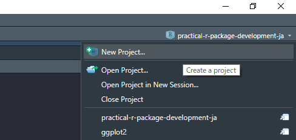
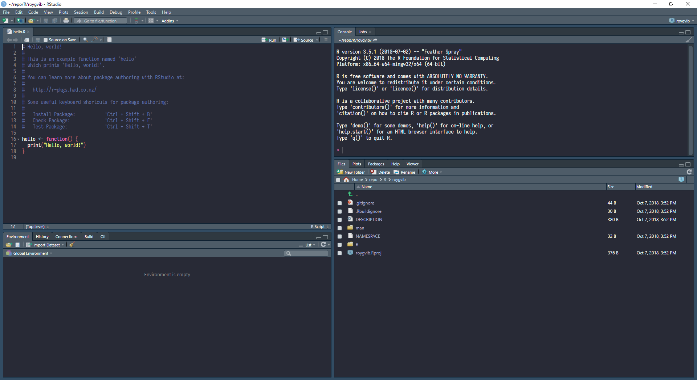
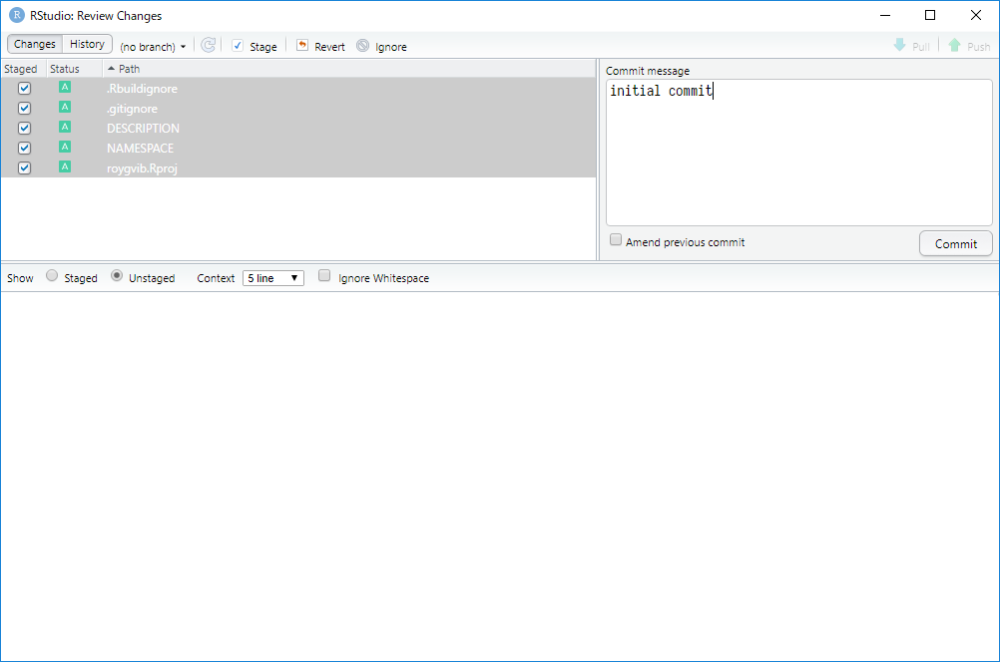

# 新しくRパッケージを作る

細かいことは抜きにしてRのパッケージを作ってみよう。RStudioと[usethisパッケージ](https://usethis.r-lib.org/)を使えばそれは簡単にできる。

## RStudioからRのパッケージをつくる

右上のプロジェクトアイコンから*New Project*を選ぶ。

```{r new_project, out.width = '75%', echo=FALSE}

```

次に、*New Directory*、*R Package*と選んでいく。

```{r new_project2, out.width = '50%', echo=FALSE}
knitr::include_graphics(
  c("img/screenshot_new_project2.png",
    "img/screenshot_new_project3.png")
)
```

最後に、Rのパッケージ名を入力し、*Create a git repository*にチェックを入れたら、*Create Project*をクリックする。

```{r new_project3, out.width = '75%', echo=FALSE}
knitr::include_graphics("img/screenshot_new_project4.png")
```

これでひとまずひな形が完成する。しかし、ここからまだやることは多いので油断しないように。

```{r new_project_look, out.width = '100%', echo=FALSE}

```

## RStudioのプロジェクト設定を変える

ドキュメントや`NAMESPACE`はRoxygen（後述（たぶん））を使って書きたいので、そのあたりがビルド時に自動で生成されるように設定を変更する。
*Build*メニューから*Configure Build Tools...*を選び、*Generate documentation with Roxygen*にチェックを入れる。
チェックを入れるとポップアップが出るが、そこで選ぶべきものは特にないので、そのまま*OK*を押せばいい。

```{r enable_roxygen, out.width = '50%', echo=FALSE}
knitr::include_graphics(
  c("img/screenshot_configure_build_tools.png",
    "img/screenshot_enable_roxygen.png")
)
```


## 不要なファイルを消す

初期状態では`hello.R`みたいなファイルが見本として置かれているが、不要なので消す。具体的には以下の3つ。

* `R/hello.R`
* `man/hello.Rd`
* `NAMESPACE`

`NAMESPACE`を消す（`usethis::use_namespace()`で上書きしてもいい）のは、初期状態の`NAMESPACE`があるとRoxygenによる自動生成が動かないため（Roxygenは、既に存在している`NAMESPACE`がRoxygenで自動生成されたものでなければ上書きしない）。

消した後で<kbd>Ctrl</kbd>+<kbd>Shift</kbd>+<kbd>D</kbd>（Windowsの場合）でドキュメントを生成してみよう。
以下のような`NAMESPACE`ができているはずだ。

```r
# Generated by roxygen2: do not edit by hand

```


## Git

### コミット

このあたりまでは間違いないが、次のステップでは色々なパターンがあるので間違えた場合に備えていったんコミットしておく。
<kbd>Ctrl</kbd>+<kbd>Alt</kbd>+<kbd>M</kbd>（Windowsの場合）でコミット画面が開くので、全ファイルにチェックを入れ、「initial commit」のような適当なメッセージを入れて*Commit*を押す。

```{r git_commit, out.width = '75%', echo=FALSE}

```

### remoteを設定

ついでに、GitHubにレポジトリを作ってremoteに設定しておこう。
まずは同名のレポジトリを作成する。
この際、*Initialize this repository with a README*や*Add a license*は指定せず空のレポジトリにすること。
すでにファイルがコミットされた状態だと、今手元にあるものとコンフリクトが生じてしまう。

```{r create_new_repo, out.width = '75%', echo=FALSE}
knitr::include_graphics("img/screenshot_create_new_repo.png")
```

空のレポジトリをつくると、以下のようにremoteを加えるよう指示が出ているのでこれをそのままTerminalにコピペする（pushはまだしなくてもいい）。

```{r remote_add, out.width = '75%', echo=FALSE}
knitr::include_graphics("img/screenshot_git_remote_add.png")
```

## `DESCRIPTION`を修正

usethisパッケージも万能ではない。手作業でやらないといけない作業もいくつかある。
（後回しでいいが、`Title`フィールドや`Description`フィールドを適切に埋めるのも忘れずに）

### `Version`

デフォルトの`DESCRIPTION`だと`Version`フィールドは以下のようになっている。

```
Version: 0.1.0
```

ここは好みだが、開発し始めたこのパッケージはまだ`0.0.1`にも達していない、という気分なら`0.0.0.9000`にしておく。

```
Version: 0.0.0.9000
```

### `Authors@R`

デフォルトの`DESCRIPTION`だと`Author`フィールドと`Maintainer`フィールドは以下のようになっている。

```
Author: Who wrote it
Maintainer: The package maintainer <yourself@somewhere.net>
```

ここも好みだが、まとめて`Authors@R`フィールドにした方がナウい気がするのでそうする。

```
Authors@R: person("Hiroaki", "Yutani", role = c("aut", "cre"), email = "yutani@example.com")
```


## usethisパッケージで必要な設定を追加

ここから先はusethisにまとまっているのでそれを活用する。

### ライセンス

ライセンスを追加するには、MITライセンスなら`use_mit_license()`を実行すればいい。
`DESCRIPTION`の`License`フィールドを書き換え、`LICENSE`や`LICENSE.md`を追加し、`.Rbuildignore`に加えてくれる。

```{r eval=FALSE}
usethis::use_mit_license("Hiroaki Yutani")
```

他にも、`use_gpl3_license()`（GPLv3）、`use_apl2_license()`（Apache License 2.0）が用意されている。
データのみのパッケージの場合は`use_cc0_license()`（CC0）がいいらしい。

ちなみに、引数に名前を指定するのは`usethis.full_name`というオプションが設定されていれば省略できる。
`.Rprofile`に以下を書き加えておくのもいいだろう。`.Rprofile`は`usethis::edit_r_profile()`で開くのが早い。


```{r eval=FALSE}
options(usethis.full_name = "My name")
```

### Roxygen + Markdown

RoxygenにはMarkdown記法^[https://cran.r-project.org/web/packages/roxygen2/vignettes/markdown.html]を使うことができる。Markdown記法には落とし穴も多いが、手軽に書けるので便利ではある。
Markdown記法を有効にするには`use_roxygen_md()`を使う。といってもこの関数は特に何もせず、`roxygen2md::roxygen2md()`を実行するように促すだけのようだ。

```{r eval=FALSE}
usethis::use_roxygen_md()
```

### `README.Rmd`

`README`を追加するには`use_readme_rmd()`を使う。もしくは、R MarkdownファイルではなくMarkdownファイルにしたい場合は`use_readme_md()`もある。

```{r eval=FALSE}
usethis::use_readme_rmd()
```

ところで、この`README.Rmd`をさっそくコミットしようとすると以下のようなエラーメッセージを見ることだろう。

```
README.md is out of date; please re-knit README.Rmd
use 'git commit --no-verify' to override this check
```

これは、「Rmdとmdのどちらかに更新がある場合もう片方も更新されなければいけない」というpre-commit hookも同時に追加されているからだ。
`use_readme_rmd()`は`README.Rmd`だけで`README.md`は追加してくれない。ひとまず自分でknitしよう。

このhookは、knitし忘れを防ぐという意味では役に立つが、例えば、`README.Rmd`には変化がないがknitしなおしたら出力が変わる、というような場合もコミットできなくなる（RStudioのGUIからは`--no-verify`でコミットすることができない）。
面倒に感じるなら`.git/hooks/pre-commit`を削除しておいてもいい。


### testthat

おそらくテストにはtestthatパッケージを使うだろう。`use_testthat()`を実行しておこう。`tests/testthat`ディレクトリを掘ったり、`Suggests`にtestthatパッケージを追加してくれたりする。

```{r eval=FALSE}
usethis::use_testthat()
```

紛らわしいが、テストケースを追加するには`use_test("テストファイル名")`を使う。

```{r eval=FALSE}
usethis::use_test("util")
```

### CI

Travis CIは`use_travis()`、AppVeyorは`use_appveyor()`で設定できる。

```{r eval=FALSE}
usethis::use_travis()
usethis::use_appveyor()
```

具体的には、設定ファイル（`.travis.yml`、`appveyor.yml`）を追加し、各CIのウェブページを表示してくれる。バッジは勝手には追加してくれないので、以下のように表示されるコードを自分で`README`にコピペしよう（READMEのknitし直しも忘れずに）。

```
Copying code to clipboard:
  [](https://travis-ci.org/yutannihilation/roygbiv)
```

```
Copying code to clipboard:
  [](https://ci.appveyor.com/project/yutannihilation/roygbiv)
```

### `NEWS.md`

まだリリースもしていないのにちょっと気が早いかもしれないが、`NEWS.md`を追加するには`use_news_md()`を使う。

```{r eval=FALSE}
usethis::use_news_md()
```
